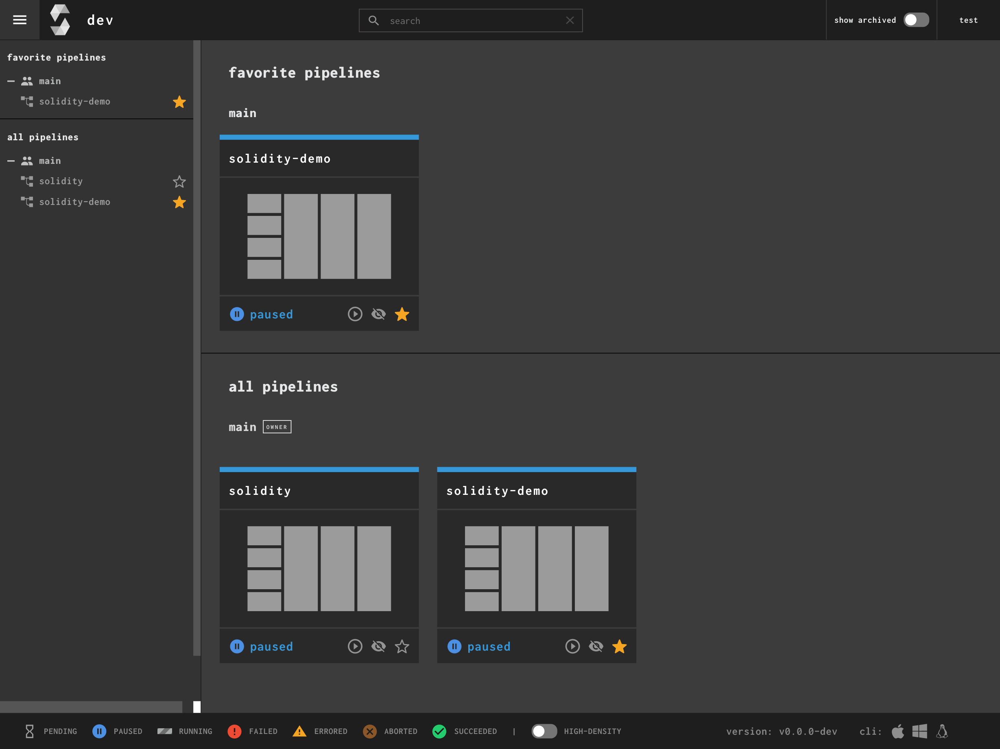
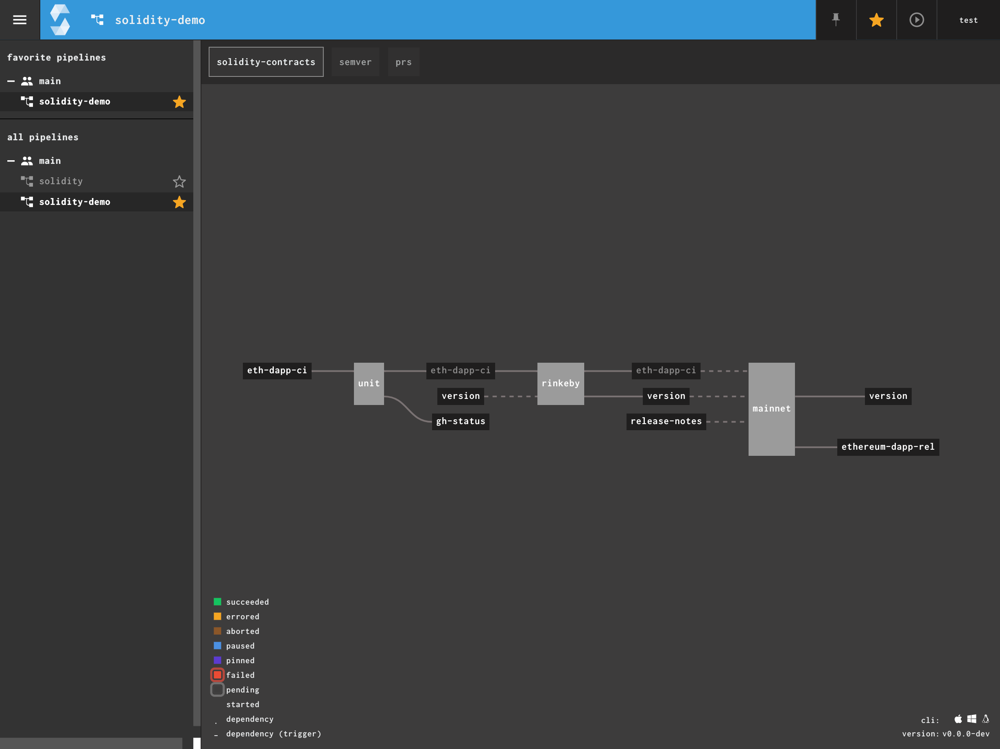
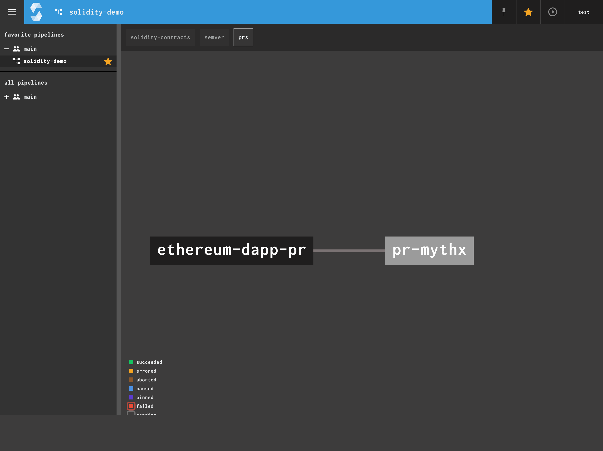
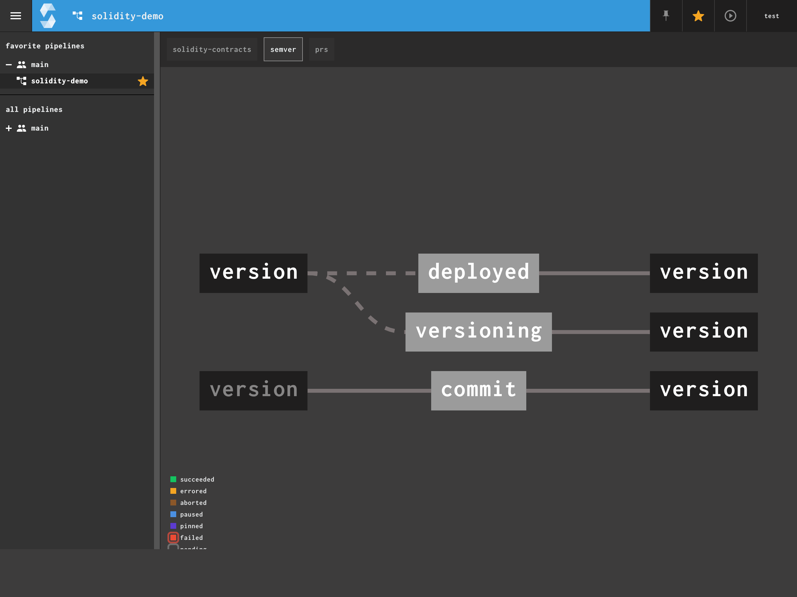
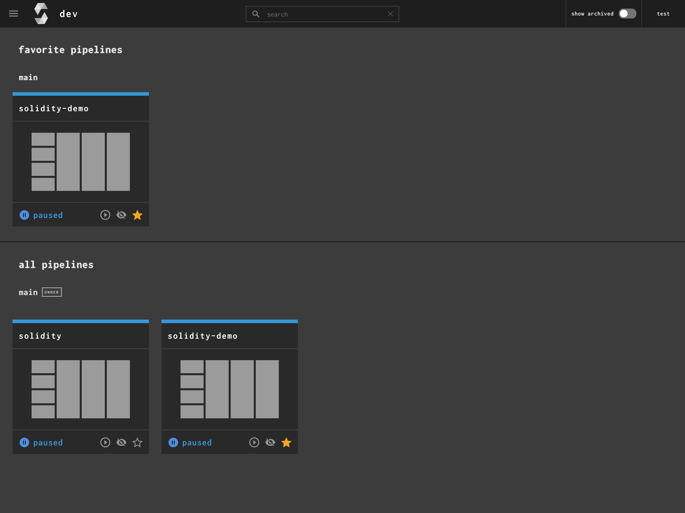

# Solidity-CI

> Multi-CI/CD Development, Deployment, and Management Suite for Industrial DApps

## Overview

Managing Smart Contracts at scale is difficult, especially for a distributed team. Add in key management, different computing environments, etc, and it creates a non-uniform development experience amongst engineering teams. `Solidity-CI` is a *framework* of tooling that enables teams to not only manage their development and deployment process, it also bundles in lifecycle management, e.g. monitoring and threat assessments in real time.

*Solidity-CI* is not a replacement for things like `truffle`, `eth-waffle`, `eth-saddle`, `buidlr`, `mythx`, etc. Solidity-CI combines these basic components:

* Solidity Version Management
* EOA Transaction Account Signing
* Solidity Compiler
* Git-DevOps
* Event Streams
* Contract Monitoring

## Demo

 
 

<align="center">

 
 

<align="center">

 
 

<align="center">

 
 

<align="center">

 
 

<align="center">

 
 

<align="center">

### Supported Versions

`0.3.6+`

You can find specific versioning information used here at [every solidity release catalog file](https://gist.github.com/sambacha/116b0dfc5c99cc8905545d63002b8f94)

| Version | Build | Date  (yyyy-mm-dd) |
| :---: | :---: | :---: |
| Version 0.6.4 | MDc6UmVsZWFzZTI0MzgwNTQ3 | 2020-03-10T15:26:16Z |

### Features

| Current               | Planned |
| -------------------- | ---------------------- |
| Basic Contract Analysis | Econometric Analysis  |
| Solidity Compile from 0.3.6+ | Super Optimizer  |

## Services

Basic Services. Expand to see more details.

  
Contract Analyzer (e.g. MythX)

   
  Runs MythX
  

  
Compile with flags

   

  This flag controls the compiler, generate specific outputs e.g. `function-hashes`

  

  
Deep Analysis

   

  Iterative Scenario with Econometric modeling applied based upon economic parameters 

  

## Using the service

*Build yourself*

*For further deployment templates and options see:* [Deployment Documentation](docs/deployment.md)

| Method              | Trigger                 |
| ------------------- |:----------------------- |
| Truffle | On creation of a Production Release.   Deployed to mainnet `chainid: 1` |
| Web3 Provider | On commit to branch with pattern `build/development`.   Deployed to `testnet` `ropsten`

## Roadmap

*Roadmap Details*

[Improvement Roadmap](CONTRIBUTING.md)

## License

SPDX-License-Identifier: MPL-2.0